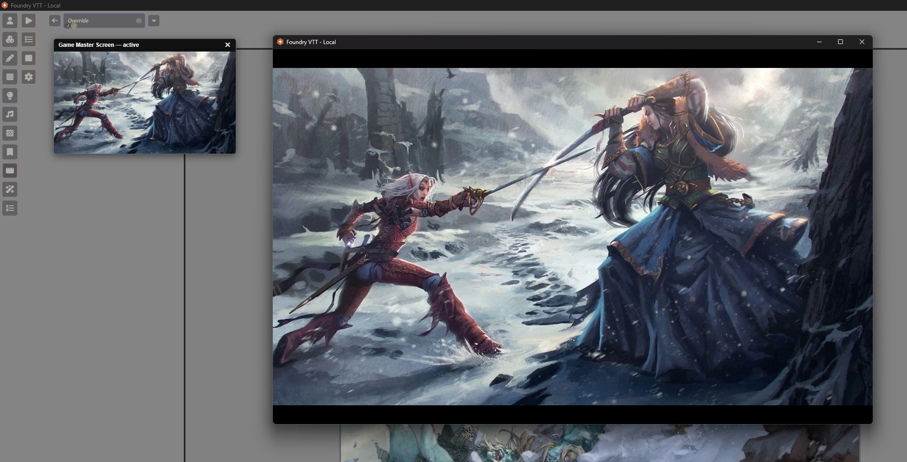

# Game Master Screen

A Foundry VTT module for a full-screen, GM-controlled overlay — for pauses,
intermissions, and scene transitions — with a compact, non-blocking GM
preview pane so triggering it never gets in the way of running the game.



📸 **[Visual Guide](docs/GUIDE.md)** — screenshots of every part of the
module, if you'd rather look than read.

---

## Features

**Three ways to trigger**
- **Manual** — a scene-controls toolbar button. Fire it anytime: a five
  minute break, a dramatic reveal, whatever the moment calls for.
- **Trigger Preset** — a separate toolbar button that fires any saved
  preset directly, as a one-off override that never touches the
  global-default Settings.
- **Automatic on Scene Activation** — optionally shows Game Master Screen
  whenever a GM activates a scene (the "Activate" button, not just
  viewing it), using whatever media is currently configured (or that
  scene's own Override, if it has one — see Per-Scene Overrides below).

**Three media modes**
- **Single Image**
- **Image List** — rotates through a GM-curated, ordered list of images,
  with optional randomized order each time it's triggered
- **Video**

**Universal audio, fit, and timing** — apply regardless of which media
mode is active:
- An independent audio track that can pair with any mode (forces a
  video's own audio off when set, so it doesn't play both at once)
- Picture/Video Fit: Contain, Cover, Stretch, or Original size
- Loop, Mute, and a Volume slider with a live percentage readout
- Duration (auto-close after N seconds, or leave at 0 to close manually)
- Fade In / Fade Out (ms), with audio volume ramped down in sync on
  fade-out rather than cutting audio dead

**Presets** — save named configurations and reload them instantly, update
an existing preset in place, or save variations as new ones. Manage
(rename/reorder/delete) from a dedicated Presets app, reachable from
Settings or from core Foundry's own Settings menu. A separate **Trigger
Preset** scene-controls tool fires any saved preset directly as a one-off
override — it doesn't touch or read the persisted global-default
settings, so it never overwrites your configured look.

**GM experience**
- A small, draggable, non-blocking preview pane (not a full-screen
  block) — the GM keeps full canvas access to manage tokens, lighting,
  and scenes while the players' screens are locked
- Configurable size (Small / Medium / Large / Extra Large) and an
  opt-in audio toggle, both personal per-GM-account preferences —
  useful for a co-GM or second-monitor setup that wants a different
  experience than the primary GM
- Works correctly for both the Gamemaster and Assistant Gamemaster
  roles
- Any GM account can close it for everyone — including recovering from
  a crash or dropped connection on whichever GM triggered it

**Player experience**
- Full-bleed, opaque overlay — no UI bleed-through
- All keyboard and mouse input is inert while it's active, as if the
  screen were paused
- A client that connects mid-activation (late join, reload, reconnect)
  catches up automatically instead of missing the moment entirely

**Scene playlist coordination** — when triggered by scene activation,
automatically silences that scene's own linked playlist (if it has one)
so it doesn't layer on top of GMS's own audio, and resumes it once GMS's
fade-out finishes.

---

## Requirements

Requires Foundry VTT V14. Built and verified against 14.364. Does not
support V13 — the Scene Config per-scene Override tab relies on V13/V14's
ApplicationV2 sheet structure in a way that hasn't been tested against
earlier or later major versions, so compatibility is capped at V14 until
explicitly verified otherwise.

---

## Installation

Install via the module manifest URL in Foundry's Add-on Modules browser,
or download and extract into your `Data/modules` folder.

---

## Usage

**Scene Controls** — a new "Game Master Screen" category appears in the
left-hand scene controls toolbar for GMs, with four tools:
- **Trigger** — fires Game Master Screen using the currently configured
  media. Safe to click even if it's already active (no-ops with a
  notification rather than double-firing).
- **Trigger Preset** — opens a small popup listing saved presets by name,
  in the same order they're arranged in the Presets Manager. Clicking one
  fires Game Master Screen with that preset's config immediately, then
  closes the popup. Ephemeral — it's a one-off override for that single
  trigger and never reads or changes the global-default Settings.
- **Close** — ends it for everyone, from any GM account. Safe to click
  even if nothing's active; this is the "nuke" button for recovering
  from a crash or a stuck state.
- **Settings** — opens the configuration form.

**Settings** — configure media mode, universal audio/fit/timing options,
and the automatic scene-activation trigger. Includes:
- **Preview** — renders the full player-facing overlay locally on your
  own screen only, using whatever's currently in the form (not yet
  saved). Click anywhere to dismiss.
- **Save as Preset** — captures the current form values under a name.
  If a preset is already selected in the dropdown, offers to update it
  in place instead of only creating new ones.

**Presets Manager** — rename, reorder (up/down arrows), or delete saved
presets. Reordering here also controls the order presets appear in the
Trigger Preset popup.

**Personal preferences** (Foundry's core Settings list, per GM account):
- **GM Popout Size** — Small, Medium, Large, or Extra Large
- **GM Popout Audio** — off by default; opt in if you want to hear the
  audio in your own preview pane too (mainly useful for fully remote
  tables)
- **Debug Logging** — shows on-screen notifications confirming socket
  events and lifecycle hooks are firing, for troubleshooting without
  needing to check the browser console

---

## Per-Scene Overrides

Every scene's own Configure Sheet gets a new **Game Master Screen** tab,
alongside Basics/Grid/Lighting/etc.:
- **Inherit** (default) — plays whatever the global config is set to when
  this scene is activated. Requires the global "Trigger on Scene
  Activation" setting to be on, same as if this tab didn't exist.
- **Override** — this scene uses its own media/timing config instead of
  the global default, and always fires on activation regardless of the
  global "Trigger on Scene Activation" toggle — it's this scene's own
  explicit choice, not something the global default setting governs.
  Optionally load a saved preset's values into the fields as a starting
  point (this scene's override stays its own independent copy afterward
  — it isn't kept linked to the preset).
- **Disable** — Game Master Screen never triggers for this scene, full
  stop, regardless of the global "Trigger on Scene Activation" setting.

If [Scene Loading Screens](https://github.com/DeadPanMatt/Scene-Loading-Screens)
is already configured on a scene, this tab defaults to Disabled the
first time you open it for that scene — a soft default, not a lock, so
you can still switch to Override or Inherit if you'd rather GMS win for
that particular scene.

---

## Macro/Scripting API

For triggering GMS from outside its own UI — macros, other modules, or
[Monk's Active Tile Triggers](https://foundryvtt.com/packages/monks-active-tiles)'
`Run Code` action on a tile (e.g. auto-firing when a door tile opens,
rather than only from a GM's own toolbar click):

```js
const api = game.modules.get("game-master-screen").api;

await api.trigger();              // fire with the current global default
await api.triggerPreset("Ambush!"); // fire a saved preset by name or id
await api.close();                // close it early, same as the Close tool
api.isActive();                   // true/false — is GMS showing right now
```

`trigger()`, `triggerPreset()`, and `close()` all require a GM account —
each resolves `false` and logs a console warning if called from a
non-GM client, rather than throwing an opaque permissions error further
down. `isActive()` has no such restriction, since checking whether GMS
is already showing is a reasonable thing for a player-side macro
condition to do too.

`triggerPreset()` matches on a preset's id first, then falls back to
its display name (case-insensitive) — either the id from the Presets
Manager or the name shown there works as the argument.

---

## Roadmap

Per-scene overrides, the Trigger Preset toolbar tool, and the
Macro/Scripting API have all shipped. No further items currently
planned — open an issue if you run into something worth adding.

**Considered and shelved for now:** hijacking Foundry's native
spacebar-pause to also show Game Master Screen. The convenience of one
fewer click didn't outweigh the risk of an accidental spacebar press
triggering a full-screen overlay for every player, versus today's small
UX cost of a single deliberate Trigger click.

---

## Compatibility Notes

Game Master Screen's automatic "Trigger on Scene Activation" feature can
overlap with other modules that also show something on scene load or
change. Known potentially-overlapping modules:

- **[Scene Loading Screens](https://github.com/DeadPanMatt/Scene-Loading-Screens)**
  — manually-triggered per-scene loading overlays (image/video/audio/text).
  Only collides if a GM uses its "Play Loading Screen" action, since that
  action calls `scene.activate()` internally.
- **[Loading Screen](https://github.com/NoWitchCraft/loading-screen)**
  — replaces Foundry's default loading popup automatically on every scene
  switch by default. Higher chance of collision than the above, since it
  auto-triggers rather than requiring a manual action.

If you use either alongside GMS, the per-scene Game Master Screen tab
(see [Per-Scene Overrides](#per-scene-overrides) above) automatically
defaults a scene to Disabled the first time you open its config if Scene
Loading Screens is configured there — no manual setup needed for the
common case, though you can still override that default per scene.

This list isn't exhaustive — if you run into a conflict with another
scene-loading or intermission-style module not listed here, please open
an issue.

---

## License

MIT
