# Game Master Screen — Visual Guide

A screenshot walkthrough of every part of the module, companion to the
main [README](../README.md). Sections follow the same order as the
README's Usage and Per-Scene Overrides sections.

---

## Scene Controls Toolbar

The "Game Master Screen" category in the left-hand scene controls
toolbar, with all four tools visible: Trigger, Trigger Preset, Close,
Settings.

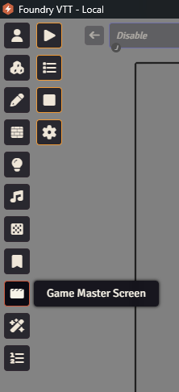

Clicking **Trigger Preset** opens a small popup listing saved presets in
the order they're arranged in the Presets Manager — click one to fire it
immediately.

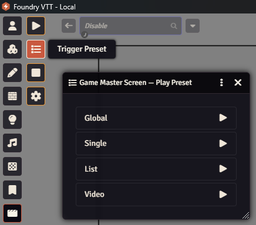

---

## Settings

Reachable either from the **Settings** toolbar tool above, or from
Foundry's own core Configure Settings menu:

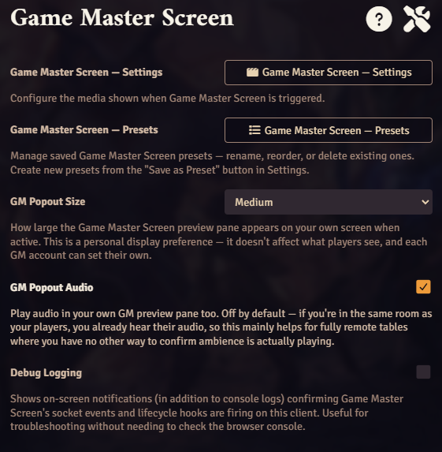

The full Settings form, with the Preset dropdown, Media Mode selection,
and universal Media/Timing/Automatic Triggers sections:

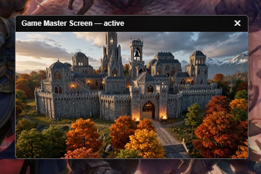

### Media Modes

Each mode reveals its own fields, with the universal Media and Timing
Configuration sections always visible below regardless of which is
selected.

#### Single Image

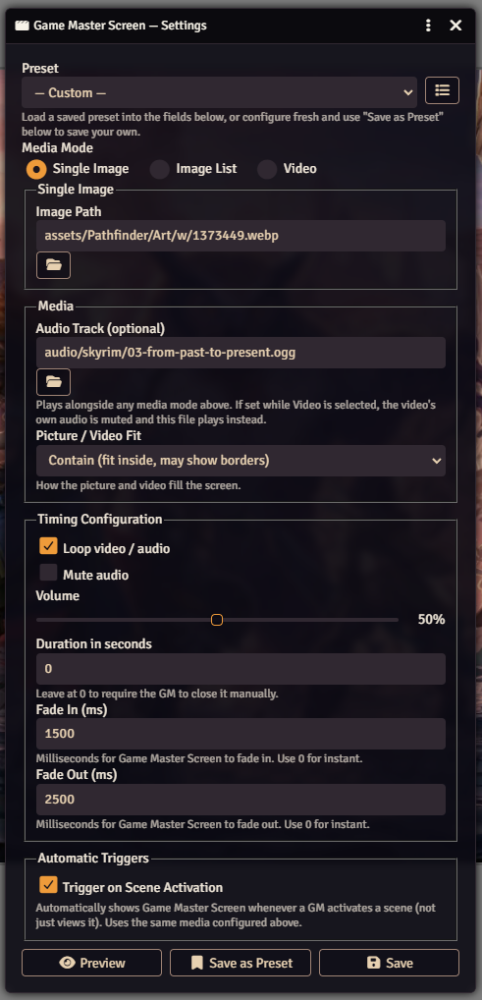

#### Image List

An ordered, GM-curated list with optional shuffle and a configurable
rotation interval.

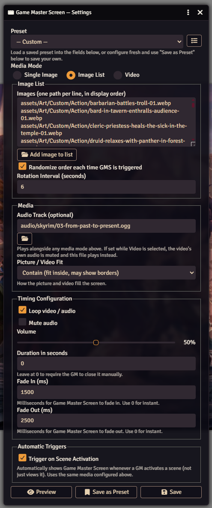

#### Video

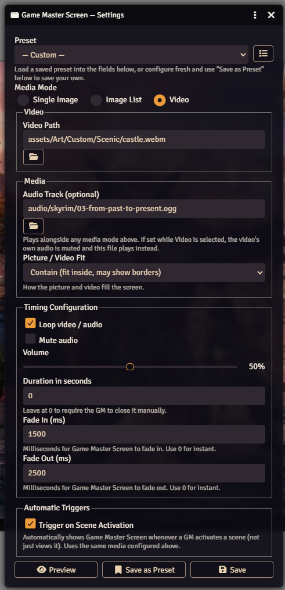

### Save as Preset

Captures the form's current values under a name. If a preset is already
selected in the dropdown, offers to update it in place instead of only
creating new ones.

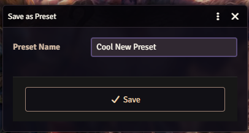

### Presets Manager

Rename, reorder (up/down arrows), or delete saved presets — reordering
here also controls the order presets appear in the Trigger Preset popup.

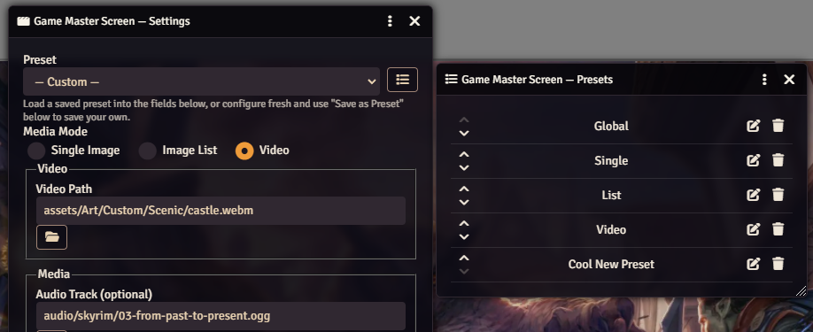

---

## Per-Scene Overrides

Every scene's own Configure Sheet gets a new **Game Master Screen** tab.

**Inherit** (default) — plays whatever the global config is set to when
the scene is activated:

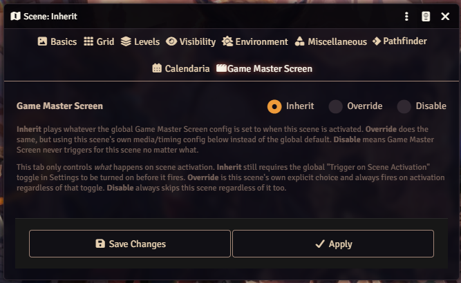

**Override** — the scene uses its own media/timing config instead of the
global default, and fires on activation regardless of the global
"Trigger on Scene Activation" toggle:

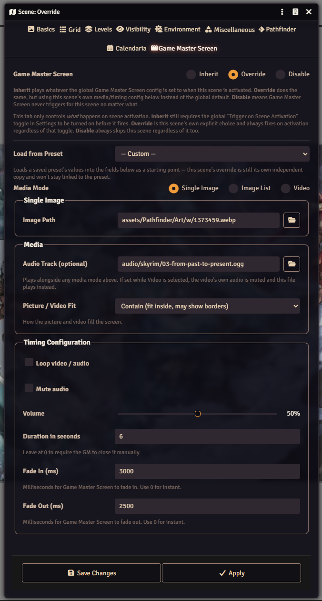

---

*Screenshots may lag slightly behind the latest UI copy/wording as the
module evolves — the [README](../README.md) is the source of truth for
current behavior if the two ever disagree.*
